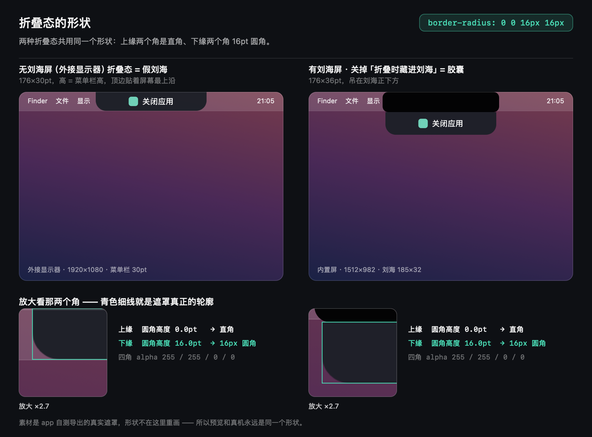

# CloseApps — 应用关闭面板（灵动岛版）

<p align="center">
  
</p>

一个 macOS 原生小工具：**常驻在屏幕顶部正中**——有刘海的 Mac 上，它折叠时**就藏在刘海后面，屏幕上什么也看不到**（没有刘海的屏幕则折成一枚**和菜单栏一样高的"假刘海"**，相当于白送一块刘海）；鼠标移到顶部正中一碰，它就动画展开成半透明毛玻璃面板，以统一卡片网格列出正在运行的应用（图标 / 名称 / PID / 窗口数）；打开 **≥2 个窗口**的应用会跟随显示每张窗口的**窗口卡片**。点应用卡的 **✕** 将其连同所有辅助进程**彻底关闭**；点窗口卡打开该窗口或**只关闭这一个窗口**。鼠标移开自动收起。

## 三种打开方式

| 方式 | 操作 |
| --- | --- |
| **灵动岛** | 鼠标移到屏幕顶部正中（有刘海就是刘海那一块）自动展开；移开后约 0.45 秒自动收起。**停在那不动、或只是从刘海往下挪，都不会被误收** |
| **全局快捷键** | 默认 **⌥⌘K**，随按随开/关，可在面板里点快捷键按钮改成任意组合 |
| **菜单栏图标** | 左键点击开关面板；右键出菜单（灵动岛开关 / 开机启动 / 改快捷键 / 退出） |

点卡片切换到别的应用后，面板会自动收起——因为你的鼠标已经不在面板上了。想让面板一直挂着，点 **📌 钉住**（鼠标移开也不收）。

## 使用

```bash
open CloseApps.app
```

应用已安装到 `/Applications/CloseApps.app`。**它常驻在后台，没有 Dock 图标、也不出现在 ⌘Tab 里**——关掉面板不等于退出应用。退出请走菜单栏图标右键 → 退出 CloseApps。

- 展开态面板的顶边固定在**刘海下沿（没有刘海就是菜单栏下沿）**，只往下长，596×620
- **折叠态有三种长相**，看屏幕和开关而定：
  - **有刘海 + 「折叠时藏进刘海」开着** → 彻底藏进刘海。面板不是"变透明"，而是**正好铺满刘海那块物理盲区**——摄像头模组挡着，那块屏幕本来就不显示内容，相当于它不存在（阴影也一起关掉，否则会投到刘海下面露馅）。刘海尺寸**从系统读出来**（本机内置屏实测 185×32），往下留 12pt 做悬停容错
  - **没有刘海的屏**（比如外接显示器）→ 折叠态是一枚**「假刘海」**：**高度 = 菜单栏高度**（本机外接屏实测 30pt），**顶边贴着屏幕最上沿，上缘两个角是直角、下缘两角是 16pt 圆角**（一个式子说清：`border-radius: 0 0 16px 16px`），看上去就是从屏幕顶垂下来的一块，相当于白送一块刘海。展开时面板正好从它的下沿（= 菜单栏下沿）长出来，无缝衔接
  - **有刘海但关掉了「折叠时藏进刘海」** → 一枚 176×36 的胶囊，挂在刘海下沿，上缘那对直角正好和刘海下沿对齐，看上去就像从刘海里垂下来的一块
  - **只要露在外面，形状都是同一个**：假刘海和胶囊共用 `border-radius: 0 0 16px 16px` —— 上缘两角直角（贴住屏幕最上沿 / 刘海下沿），下缘两角 16pt 圆角。藏进刘海那种态不用管形状（反正看不见），展开的面板则是四角 18。想直接看形状不用跑去外接屏跟前，见本节末尾那张对照图（也可用「调试」里的命令随时重新生成）
- **能拖，但拖的是面板，而且位置不留痕**：展开后按住标题栏的空白处可以把面板挪开（**只有展开态能拖** —— 鼠标一 hover 上来面板就展开了，等你按下时它早就不是折叠态）。**位置不缓存：每次打开都回到初始位置**（屏幕顶部正中、从菜单栏/刘海下沿往下长），所以拖动只是本次"临时挪一下"，收起再打开又回原位。**折叠态的胶囊也不跟着动** —— 它是钉在屏幕顶部正中的"刘海"。拖到屏幕边缘会被挡住不会丢。**跨屏拖动不会跳** —— 面板位置按绝对坐标算，鼠标从这块屏拖到那块屏，它就一路跟着走；要是按"相对某块屏的中心"算，一跨屏基准就换了，面板会瞬间闪到另一块屏的对应位置去（大屏右侧 → 小屏右侧）
  - **标题栏上那几个按钮（录制快捷键 / 钉住 / 刷新 / 收起）不在拖动区里**：点在按钮上就是点按钮，不会被拖走
- **展开/收起是弹簧动画**（约 0.3s，末端带极轻的过冲 ~1%）：窗口大小、四角圆角、内容透明度挂在**同一条**曲线上一起走。从刘海/假刘海里"长"出来的时候形状是连续变化的（假刘海那枚的上缘直角会一路长成圆角），内容也是全程淡入 —— 不是"面板先长完、内容再啪地补上"。收起同理，反过来走一遍
- **悬停的判定范围 = 面板本身 + 折叠命中区（刘海那一带）**：鼠标停在刘海正中最上面那些位置时面板不会误收——那正好是它展开后"够不着"的地方，之前就是在这儿来不及往下移就关了
- **收起后不会立刻自我重开**：只有当鼠标离开过命中区（或等满 1.5 秒兜底）才允许再展开。所以"鼠标一直在旁边蹭"也不会打不开
- **双屏的话胶囊会跟着鼠标走**：折叠态每秒看一眼鼠标在哪块屏，跨屏了就挪过去，不用去另一块屏找它
- 面板与卡片都是**半透明毛玻璃**（`NSVisualEffectView`），能透出桌面和背后的窗口，亮暗模式自动适配
- 卡片为系统原生**振动材质**（`popover`）；鼠标悬停时卡片切换为强调高亮、✕ 变红 —— 与通知中心小组件的交互一致
- 应用多到一屏装不下时，面板右侧才会出现滚动条，而且**比系统默认细一半**（系统 17pt → 本应用 8pt）。做法是给 `NSScroller` 写个只覆写类方法 `scrollerWidth(for:scrollerStyle:)` 的子类 —— 实例上改 `controlSize` / 改 frame 都会被布局重算覆盖回去，从外面量不出效果
- 卡片自动刷新（展开状态下每 2 秒 + 应用启动/退出事件实时触发）。**折叠时不轮询**，省电
- **窗口卡片**：授权「辅助功能」后，**打开 2 个及以上窗口的应用**会在其应用卡片后面跟随显示每张窗口的大卡片（应用图标 + 窗口标题）——**点击窗口卡片打开（前置）那个具体窗口**（跨桌面自动切换、最小化自动还原），点卡片上的 ✕ 只关闭这一个窗口。只有 0/1 个窗口的应用不显示窗口卡（应用卡已覆盖）；无标题的隐藏窗口自动过滤。所有卡片同尺寸、按名称顺序**连续流式排列不留空位**
- **✕ 彻底关闭**：连同应用的所有辅助进程（微信的小程序/Helper 进程、Chrome 的 GPU/渲染进程、VS Code 的扩展宿主等）一起清理 —— 点击时先记下整个进程树，礼貌退出 2.5 秒后仍存活则对全树 SIGKILL
- **点击卡片本身**：激活该应用（等同点 Dock 图标，**在其他桌面也会自动切换过去**）
- **找不到灵动岛？** 有刘海的屏幕折叠时它是隐形的（这正是设计意图）——把鼠标移到屏幕**顶部正中**、尽量往最上沿扫，指针进到刘海那一块就会展开（指针在刘海里是看不见的，这是硬件的事）。不习惯的话可以在菜单栏图标右键菜单里取消「折叠时藏进刘海」，它就变回刘海下沿那枚可见胶囊。想临时挪开挡视线的面板：展开后按住标题栏的空白处拖；位置不缓存，下次打开它还是在初始位置，胶囊本身更是始终钉在屏幕顶部不动
- 展开状态下按 **Esc** 或点右上角 **⌃** 收起
- 面板不抢焦点：它是「不可激活面板」，鼠标扫过去不会打断你正在打字的窗口；卡片上第一次点击就直接生效，不需要点两下

<p align="center">
  
</p>

上面这张图**不是拿截屏拼的，也不是重画的**：它把 app 自己算出来的那两张遮罩合成到模拟屏幕上，
所以图上是什么形状、真机就是什么形状。两边读数都是「上缘圆角高度 0.0pt / 下缘圆角高度 16.0pt」，
和 `border-radius: 0 0 16px 16px` 对得上（无刘海屏那枚的顶边贴屏顶，上缘那对直角被屏幕边"切掉"，
所以看起来是从屏幕顶垂下来的一块）。

## 开机自动启动

菜单栏图标右键 → **开机自动启动**。

- macOS 13 及以上用系统的 `SMAppService`，在「系统设置 › 通用 › 登录项与扩展」里能看到、能关
- macOS 11/12 退回 `~/Library/LaunchAgents/com.liulao.closeapps.launch.plist`
- 第一次开启若提示「需在系统设置里允许」，去「系统设置 › 通用 › 登录项与扩展」把 CloseApps 打开即可
- **把 App 挪到别的位置后要重新勾一次**（系统按路径记登录项）

## 自动检查更新

启动后静默查一次，之后每 6 小时一次；查到新版本时，展开的面板顶部会出现一行「新版本 x.y.z 可用 · 点此查看」，点击打开 Releases 页面。菜单栏图标右键里另有 **检查更新…**（手动查一次并给出结果）和 **自动检查更新**（开关，默认开）。

- **不用上架、不用开发者账号、不用任何系统授权** —— 它就是一个只读的 HTTPS 请求
- 读的是 GitHub 公开接口：`api.github.com/repos/liulao-space/close-app/releases/latest`
- **不发送任何本机信息**（请求头里只有 `User-Agent: CloseApps/<版本>`，那是 GitHub 要求每个请求都带的）
- 没有新版、网络不通、超时 —— 一律静默放弃，不弹窗、不影响使用；不想让它查，菜单里关掉「自动检查更新」即可

> 这跟「系统推送通知」是两码事。后者要上架 + 开发者账号 + 用户点「允许通知」+ 一台服务器，个人开发者确实做不了；而「自己去看一眼有没有新版本」，任何 App 都能做。

## 首次使用需要授权

显示窗口标题需要「辅助功能」权限：打开 **系统设置 → 隐私与安全性 → 辅助功能**，勾选 CloseApps。未授权时展开的面板顶部会有一条橙色横幅，点一下直接跳到设置；有刘海的屏幕上折叠态是隐形的，那个橙色提示点只有展开后才看得到。不授权也能用，只是看不到窗口列表。

注意：本应用用自签证书签名（`build.sh` 里的 "CloseApps Dev" 身份）。**签名身份固定，重新编译后授权依然有效**；只有找不到该证书退回 ad-hoc 签名时，macOS 才会视为新应用，需要把列表里的 CloseApps 取消勾选再重新勾选一次。

- 面板自己不会出现在列表里（防止把自己关掉）；后台进程（菜单栏工具等）也不显示，只列出有窗口的常规应用

## 给使用者的安装指南

**方式一：下载安装包（推荐，支持 Apple Silicon 和 Intel 芯片）**

1. 到 [Releases](../../releases) 页面下载最新的 `CloseApps.dmg`
2. 打开 DMG，把 CloseApps.app 拖入 Applications 文件夹
3. 首次打开会被 Gatekeeper 拦截（应用未经过 Apple 公证）：打开 **系统设置 → 隐私与安全性**，拉到下面找到「CloseApps 已被阻止」，点 **仍要打开** → 输密码确认。这只在第一次需要
4. 打开后，屏幕顶部正中出现胶囊即成功。需要窗口卡片就再去勾「辅助功能」

**方式二：自己编译（有命令行基础）**

```bash
git clone https://github.com/liulao-space/close-app.git
cd close-app
./build.sh          # 需要 xcode-select --install 装过的命令行工具
open CloseApps.app
```

自己编译的版本本机运行不受 Gatekeeper 限制；`build.sh` 找不到 `CloseApps Dev` 签名身份时自动退回 ad-hoc 签名，不影响功能。

> 为什么首次打开这么麻烦？本应用不在 Mac App Store 上架（沙盒会禁用「彻底关闭」核心功能），也没有购买开发者计划做公证。若将来公证，这一步会消失。

## 应用图标（Logo）

图标用 CoreGraphics 脚本生成：深色圆角底板上三张毛玻璃卡片（蓝 / 绿 / 橙圆点），右下角一枚红色关闭徽章（白色 ✕），呼应应用本身的功能。

重新生成图标并打进应用：

```bash
./tools/make_icon.sh   # 生成 assets/icon_1024.png 与 assets/AppIcon.icns
./build.sh             # build.sh 会自动把 icns 打包进 .app
```

## 重新构建 / 打包

```bash
./build.sh    # 构建项目目录下的 CloseApps.app
```

安装到本机：把 `CloseApps.app` 拖入 `/Applications`（或双击 `CloseApps.dmg` 拖入其中的 Applications 快捷方式）。生成 DMG：用 `hdiutil create -volname CloseApps -srcfolder <含 .app 与 Applications 符号链接的目录> -format UDZO CloseApps.dmg`。

依赖：macOS 自带的 Swift 命令行工具（`xcode-select --install`），无第三方依赖。

## 文件结构

```
src/main.swift        全部源码（纯 AppKit，单文件：灵动岛面板 + 卡片网格 + 全局快捷键 + 登录项 + 关闭逻辑）
src/Info.plist         应用描述文件（LSUIElement = 常驻无 Dock 图标）
build.sh               构建脚本：编译并打包成 CloseApps.app
tools/make_icon.swift  Logo 绘制脚本（CoreGraphics）
tools/make_icon.sh     生成 iconset 并打包 .icns
tools/preview_fake_notch.swift
                       折叠态形状对照图：把 app 自己导出的真实遮罩合成成一张预览图
                       （不重画形状，所以预览和真机永远是同一个形状）
assets/                图标源文件（icon_1024.png / AppIcon.icns）
CloseApps.app          构建产物
```

## 调试（可选）

`src/main.swift` 里留了几个只在环境变量存在时才生效的开关，普通使用完全不走：

```bash
APP=/Applications/CloseApps.app/Contents/MacOS/CloseApps

# 状态日志（写 stderr）：展开/收起、悬停、快捷键注册、跨屏
CLOSEAPPS_DEBUG=1 "$APP"

# 内置自测：注入假光标坐标，自动把完整链路跑一遍（悬停展开 / 停在刘海带不收 /
# 移开收起 / 连续 hover 再展开 / 光标没离开时重开被拦 / 折叠态拖动无效 / 展开态拖动 /
# 跨屏拖动不跳 / 展开动画轨迹与丢帧 / 展开态按钮命中不被拖动抢走 /
# 重开回到初始位置（位置不缓存）/ 折叠态形状（假刘海 & 胶囊）/ 滚动条宽度 /
# 更新检查的版本比较与横幅 / 退出）。
# 每条断言都会往 stderr 打一行 state[...] / morph[...] / check[...]，看日志就能核对。
# 自测**只读系统设置**（开机项只探测、不改），跑完不会把你的登录项挪到那份副本上
CLOSEAPPS_DEBUG=1 CLOSEAPPS_SELFTEST=1 "$APP"

# stdin 控制台（DEBUG 模式下）：
#   dump / expand / collapse / toggle / pin / island / notch / login / quit
#   shape                 打一遍折叠条形状（layer 圆角 + 遮罩类型 + 上下缘半径）和滚动条实测宽度
#   resetpos              面板回初始位置（位置本来就不缓存，这条只是把临时偏移提前归零）
#   mouse 756 491         注入假光标坐标（本机拿不到真实鼠标事件时靠它验判定）
#   mouse clear           恢复真实光标
#   drag 120 -60          模拟一次拖动（按下 → 移动 → 松手；折叠态会被忽略）
#   mask                  导出假刘海遮罩（真实尺寸版 + 动画逐帧用的可拉伸小图）并报四个角的像素
#   update                真发一次检查更新请求（会联网），结果打到 stderr
#   fakeupdate 9.9.9      不联网，直接挂一条"新版本 9.9.9 可用"的横幅看长相
#   update-clear          清掉那条横幅

# 形状对照图：不用跑到外接屏跟前，也不用截屏权限。先让 app 把真实遮罩导出来，再合成一张预览图
printf 'mask\nquit-now\n' | CLOSEAPPS_DEBUG=1 "$APP"
swift tools/preview_fake_notch.swift      # 输出 /tmp/closeapps-shape-preview.png

```

## 注意

- 彻底关闭相当于强制结束进程，目标应用里**未保存的内容会丢失**（关闭前会先给 2.5 秒礼貌退出时间，应用若响应退出请求可正常保存退出）
- 系统自带应用如"访达（Finder）"被关闭后会自动重新启动，属正常现象
- 面板默认**在所有桌面、包括全屏应用之上**显示；如果不想要顶部的胶囊，右键菜单栏图标 → 取消「显示灵动岛胶囊」，之后只用快捷键或菜单栏图标打开
- 全局快捷键不需要任何系统授权（走 Carbon 公开 API）；如果设置的组合被别的应用占用，会提示并自动还原为上一个可用的组合

## 版本更新

每个版本改了什么，都记在 **[CHANGELOG.md](CHANGELOG.md)**。

最近的 **v1.1.1**（2026-09-16）加了**自动检查更新**：装过旧版的人终于能被通知到了 —— 启动后静默查一次 GitHub，有新版本就在面板顶部挂一行提示，点一下跳 Releases 页面；菜单栏右键里也能手动查、能关掉。

**v1.1**（2026-09-16）是「灵动岛」这一版：打开方式从一处扩成三处（灵动岛 / 全局快捷键 / 菜单栏图标），折叠态做到彻底隐形且三种长相形状统一，面板可拖动、展开收起走弹簧动画，滚动条比系统默认细一半。相比 v1.0，`src/main.swift` 从 702 行涨到 2983 行。

## 关注 / 联系

这工具是我（**流佬**）自己日常在用、顺手开源出来的 —— 不是团队产品，一个人维护。

用着有问题、有想法，或者想聊 AI 工具和折腾经历，都欢迎找我：

<table>
<tr>
<td align="center" valign="top">
  
  <br><b>公众号「流佬」</b>
  <br><sub>AI 工具 / 模型实测与教程</sub>
</td>
<td align="center" valign="top">
  
  <br><b>我的微信</b>
  <br><sub>扫二维码，添加我为朋友</sub>
</td>
</tr>
</table>

不想加微信的话，直接开 [Issue](../../issues) 说也行。
