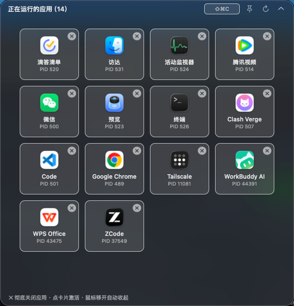

# CloseApps — 应用关闭面板（灵动岛版）

<p align="center">
  
  <br><br>
  
</p>

一个 macOS 原生小工具，常驻屏幕顶部正中（上图第二条：折叠时就是菜单栏里一枚安静的小胶囊），鼠标一碰就展开成毛玻璃面板。**✕ 彻底关闭**（连同微信小程序、Chrome 渲染进程等所有辅助进程），**点窗口卡直接打开那一个窗口**。鼠标移开自动收起。

## 功能

- **三种打开方式**：灵动岛（悬停顶部正中）/ 全局快捷键（默认 ⌥⌘K，可改）/ 菜单栏图标
- **应用卡片**：图标 / 名称 / PID / 窗口数，✕ 彻底关闭整个进程树；点卡片激活应用（跨桌面自动切换）
- **窗口卡片**：授权「辅助功能」后，开 ≥2 个窗口的应用会跟随显示每张窗口卡 —— 点击打开那个窗口，✕ 只关这一个
- **📌 钉住**：面板常驻不自动收起；**开机自启**：菜单栏右键勾选
- 面板与卡片均为系统毛玻璃材质，亮暗模式自适应；展开/收起为弹簧动画；折叠时不轮询，省电

## 安装

**方式一：下载（Apple Silicon / Intel 通用）**

1. 到 [Releases](../../releases) 下载 `CloseApps.dmg`，拖入 Applications
2. 首次打开被 Gatekeeper 拦截：**系统设置 → 隐私与安全性 → 仍要打开**（仅一次）
3. 顶部正中出现胶囊（或刘海）即成功；要窗口卡片再去勾「辅助功能」

**方式二：自己编译**

```bash
git clone https://github.com/liulao-space/close-app.git
cd close-app && ./build.sh && open CloseApps.app
```

依赖仅 macOS 自带命令行工具（`xcode-select --install`）。

## 说明

- **授权**：窗口标题需要 系统设置 → 隐私与安全性 → 辅助功能 勾选 CloseApps；不授权也能用，只是没有窗口卡片
- **自动更新**：启动后静默检查一次（之后每 6 小时），有新版本时面板顶部出现横幅，点击即应用内**下载 → 替换 → 重启**（Sparkle，EdDSA 签名校验）。可在菜单栏右键关闭检查
- **数据安全**：彻底关闭 = 强制结束进程树，目标应用未保存的内容会丢失（有 2.5 秒礼貌退出时间）；访达被关后会自动重启，属正常
- **退出应用**：无 Dock 图标、不在 ⌘Tab 里 —— 退出走菜单栏图标右键 → 退出
- 面板默认在所有桌面（含全屏应用）之上；不想要顶部胶囊，右键菜单栏图标 → 取消「显示灵动岛胶囊」

## 构建 / 发版

```bash
./build.sh    # 构建 CloseApps.app（通用二进制，无第三方依赖）
```

发新版（升好 Info.plist 版本号后）：

```bash
./tools/release.sh v1.3.0 "本次更新说明"   # 构建→DMG→签名→appcast→推送→GitHub Release 一条龙
```

图标由脚本生成：`./tools/make_icon.sh`。

## 文件结构

```
src/main.swift    全部源码（纯 AppKit 单文件：灵动岛 + 卡片 + 快捷键 + 登录项 + 更新）
src/Info.plist    应用描述（LSUIElement 常驻后台）
build.sh          构建；tools/release.sh  一键发版；tools/make_icon.sh  生成图标
assets/           图标与 README 截图；signing/  签名材料（不入库）
```

每个版本的变更见 **[CHANGELOG.md](CHANGELOG.md)**。

## 关注 / 联系

这工具是我（**流佬**）自己日常在用、顺手开源的 —— 一个人维护。有问题开 [Issue](../../issues)，或：

<table>
<tr>
<td align="center" valign="top">
  
  <br><b>公众号「流佬」</b>
  <br><sub>AI 工具 / 模型实测与教程</sub>
</td>
<td align="center" valign="top">
  
  <br><b>我的微信</b>
  <br><sub>扫码添加朋友</sub>
</td>
</tr>
</table>
